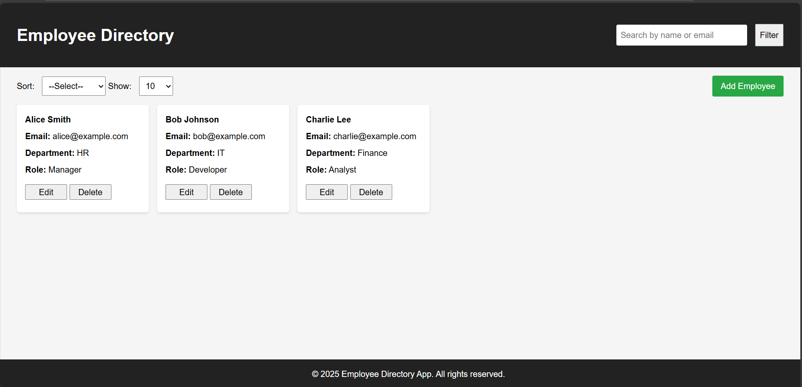

# 🧑‍💼 Employee Directory Web Interface

A responsive front-end web application to manage and display a directory of employees. Built using *HTML, **CSS, and **JavaScript*, it features searching, sorting, filtering, pagination, and CRUD operations — all without any backend dependency.

## 📁 Project Structure

employee-directory/
├── src/
│   └── main/
│       └── resources/
│           ├── static/
│           │   ├── css/
│           │   │   └── style.css         # CSS styling file
│           │   └── js/
│           │       └── script.js         # JavaScript logic file
│           └── templates/
│               └── index.html            # Main HTML file
├── image.png                              # Image file in project root
└── README.md                              # Project documentation

---

## 🛠 Setup Instructions

1. *Clone this repository*
   bash
   git clone https://github.com/yourusername/employee-directory.git
   cd employee-directory
   

2. *Open in browser*
   - Just open index.html in any modern browser (Chrome, Firefox, Edge).
   - No server or build step is needed.

---

## ✨ Features

- 🔍 Live search by name or email
- 🧩 Filter by first name, department, and role
- 🔃 Sort by First Name or Department
- ➕ Add / ✏ Edit / ❌ Delete employee
- 🧾 Pagination control (10, 25, 50, 100 entries)
- 📱 Fully responsive (Mobile, Tablet, Desktop)

---

## 📸 Screenshots

---

## 💭 Reflection

### 🔧 Challenges Faced:
- Managing responsive layout across breakpoints while keeping UI consistent.
- Handling Edit vs Add logic cleanly without losing state.
- Making sidebar filters slide in/out smoothly without layout shifting.

### 🌟 If I had more time, I would:
- Add local storage to persist employee data across sessions.
- Add pagination logic with page numbers.
- Add unit tests for JavaScript functions.
- Enhance UI with animations using CSS transitions or JavaScript.

---

## 🙌 Acknowledgments

Built as part of a front-end assignment to demonstrate clean UI/UX and dynamic behavior using vanilla JavaScript.
